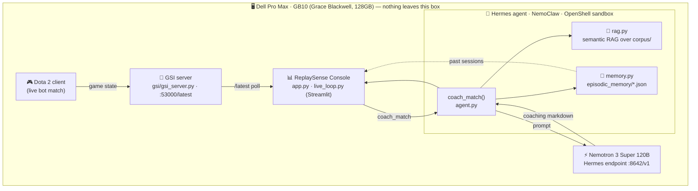

# 🎮 ReplaySense

**Local-first, self-evolving AI coach for competitive Dota 2 — running entirely on the GB10.**

> Cloud coaches see your scrim data. We don't. Every frame of game state, every
> coaching token, and every memory of your progress stays on the box.

Built at the **Dell × NVIDIA "Local AI on GB10"** hackathon. The whole stack —
a Hermes agent under **NemoClaw**, **Nemotron 3 Super 120B**, and an
**OpenShell** sandbox — runs on a **Dell Pro Max with GB10 (NVIDIA Grace
Blackwell, 128 GB unified memory)**. No cloud SDKs. No telemetry. Raw `requests`
and Streamlit only.

---

## Why this matters

Competitive teams won't upload their scrims to a SaaS coach — that's leaking
strategy to whoever runs the server. ReplaySense flips it: the model, the
knowledge base, the live game feed, and the agent's episodic memory are **all
local**. You get a coach that watches every game, learns your patterns over
time, and never phones home.

---

## Architecture



**Two layers, two Claude Code sessions during the build:**

- **Engine (Tab A):** `agent.py` (`coach_match(match) -> markdown`), `rag.py`
  (semantic RAG), `memory.py` (episodic memory).
- **Face + live layer (Tab B):** `app.py` (the console), `live_loop.py` (the
  always-on coaching loop and the `get_game_state` abstraction).

---

## What it does

| Surface | What you see |
| --- | --- |
| **Match Review tab** | Loads `data/demo_match.json`, shows a match summary, and on **Analyze Match** runs `coach_match()` → a 6-section coaching report with on-device inference latency. |
| **Live Game tab** | Polls the GSI server every few seconds, derives the laning phase from the game clock, and fires a coaching turn at each phase boundary (~60 game-seconds). Scrolling, timestamped feed with per-turn latency. |
| **Phase timeline** | A horizontal 0–10 min laning visual marking 🟢 every coaching turn and 💀 every death — so judges can see exactly when the agent coached. |
| **Coach Memory** | Reads `./episodic_memory/*.json` — the agent's growth log across sessions. This is the "self-evolving" part. |
| **Fallback Mode** | A sidebar toggle that skips the live model and renders `data/cached_response.md`. Insurance for judging if the GB10 / Hermes hiccups. |

### The `get_game_state` abstraction (live demos, guaranteed)

`live_loop.get_game_state(mode=...)` has two interchangeable sources:

- `mode="live"` → polls the GSI server at `/latest`.
- `mode="cached"` → steps through a timeline synthesized from
  `data/demo_match.json`.

A toggle in the Live Game tab switches between them, so the live tab **always
demos** even if the bot match or GSI server isn't firing.

---

## Run it

```powershell
# from the repo root, with the existing virtualenv
.\.venv\Scripts\Activate.ps1
streamlit run app.py
```

Then open the browser tab Streamlit prints (usually http://localhost:8501).

- **Match Review tab** → **Analyze Match** for a full coaching report.
- **Live Game tab** → leave the source on **🎞️ Cached timeline** and press
  **▶ Coach next turn** (or flip **Auto-advance**). Switch to **📡 Live GSI**
  once a bot match is running.
- If the model is down, flip **Fallback Mode** in the sidebar — judge-ready
  output, no inference required.

---

## Pointing at the model endpoint

Everything is driven by environment variables — nothing is hardcoded. The agent
auto-detects the backend from the URL.

| Backend | `REPLAYSENSE_MODEL_URL` | `REPLAYSENSE_MODEL_NAME` | Notes |
| --- | --- | --- | --- |
| **Hermes / Nemotron (primary)** | `http://localhost:8642/v1` | `hermes` | OpenAI-compatible `/v1/chat/completions`; bearer auth via `REPLAYSENSE_API_KEY`. |
| **Ollama (fallback)** | `http://localhost:11434/api/chat` | e.g. `qwen3:8b` | Detected by the `/api/chat` path. |

```powershell
# Point at the Hermes / Nemotron endpoint on the GB10
$env:REPLAYSENSE_MODEL_URL = "http://localhost:8642/v1"
$env:REPLAYSENSE_MODEL_NAME = "hermes"
$env:REPLAYSENSE_API_KEY    = "<token>"     # if Hermes requires one

# ...or fall back to Ollama
$env:REPLAYSENSE_MODEL_URL  = "http://localhost:11434/api/chat"
$env:REPLAYSENSE_MODEL_NAME = "qwen3:8b"

# GSI server location (optional; defaults to :53000)
$env:REPLAYSENSE_GSI_URL    = "http://localhost:53000/latest"
```

The sidebar shows a live **endpoint status** indicator so you always know
whether the console is talking to the model or should fall back.

---

## Layout

```
app.py                  # ReplaySense Coaching Console (Streamlit)
live_loop.py            # live coaching loop + get_game_state() abstraction
agent.py                # coach_match() — the engine (Hermes/Nemotron)
rag.py                  # semantic RAG over corpus/
memory.py               # episodic memory
gsi/gsi_server.py       # FastAPI GSI server (:53000/latest)
corpus/                 # Morphling knowledge base (patch 7.41b)
data/demo_match.json    # cached demo match (fallback data source)
data/cached_response.md # cached coaching output (Fallback Mode)
episodic_memory/        # the agent's growth log across sessions
```

---

*Local-only. No cloud. OpenShell sandboxed.*
